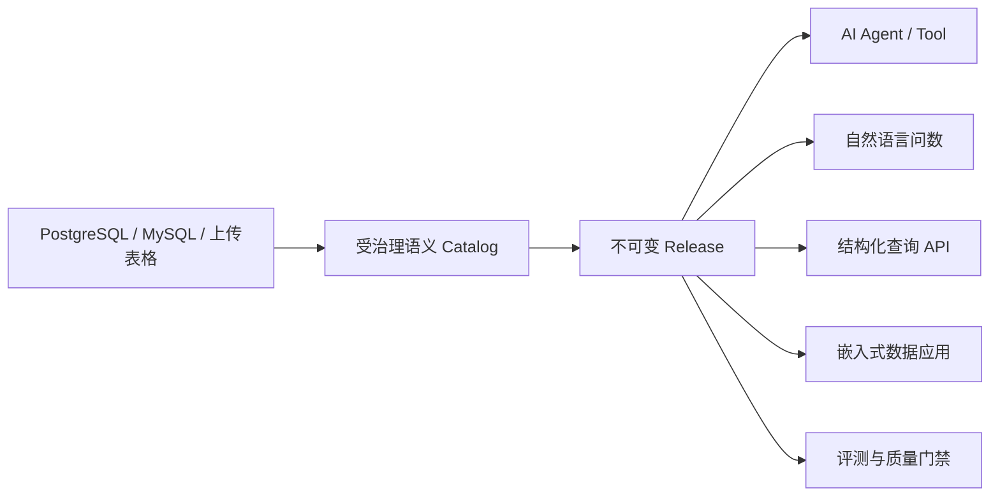

# 智能问数介绍

:::info 版本说明
- **当前版本**：KnowFlow Analytics v0.0.3
- **开源协议**：Apache License 2.0（语义建模层与受治理查询引擎）
- **商业版**：问数助手、报表、多用户 RBAC 属于商业版 KnowFlow
:::

**KnowFlow 智能问数**（KnowFlow Analytics）是一套面向 AI Agent 与数据应用的**语义层和受治理查询引擎**。

它把指标、维度、业务术语、维度值、实体关系和聚合口径维护成一份经过审核、可版本化的语义模型。同一份模型可以服务自然语言问数、AI Agent、结构化查询 API、嵌入式数据应用和回归评测，不需要为每个入口重复维护 Prompt 与 Few-shot。

---

## 核心主张

> **LLM 只负责把用户意图表达成由业务名组成的语义 SQL（S2SQL）。真正访问数据库的物理表、字段、Join、聚合和参数，由系统根据已发布的语义模型确定性编译。**

让大模型根据数据库 Schema 写出一条能执行的 SQL 已经不难。真正难的是当问数进入真实业务后：

- 如何保证「销售额」每次都指向同一个指标；
- 如何保证 Join 不会让金额翻倍；
- 如何保证 Agent、报表和 API 不会各自使用一套口径；
- 如何保证模型不确定时不会悄悄返回一个看起来合理的错误数字。

这些问题靠继续堆 Prompt 和 Few-shot 很难根治。智能问数把最难、也最值得长期维护的部分从模型上下文里拿出来，做成语义层。

---

## 为什么是语义层，而不是继续调 Prompt

典型的 Text-to-SQL 应用把 Schema、业务说明和少量 SQL 样例拼进 Prompt，让模型直接生成物理 SQL。它可以快速完成单点验证，但业务复杂后会遇到三个问题：

1. **口径漂移**：业务含义散落在 Prompt 和 Few-shot 中，不同 Agent、页面和服务各维护一份。
2. **规则无法强制**：每次提问都要重新推断指标、聚合、Join 和事实粒度。Prompt 可以引导模型，却不能强制这些规则始终成立。
3. **修复不可迁移**：补一条样例通常只覆盖当前问法。换一种表达、组合两个已有指标，或者更换模型，原来的样例未必继续有效。

| 关注点 | 直接 Text-to-SQL | KnowFlow 智能问数 |
|---|---|---|
| 业务定义 | 写在 Prompt、文档片段或 Few-shot 中 | 指标、维度、术语和值字典进入版本化 Catalog |
| Join 与粒度 | 模型根据 Schema 临时推断 | 人工确认关系基数，发布时冻结安全路径和事实根 |
| SQL 生成 | LLM 直接输出物理 SQL | LLM 输出业务名 S2SQL，Translator 编译参数化物理 SQL |
| 歧义处理 | 改 Prompt、增加样例或静默选一个 | 展示业务候选，人工确认 |
| 复用范围 | 通常绑定某个 Agent 或问数入口 | 同一 Release 服务 Agent、UI、API、评测和其它数据应用 |
| 变更控制 | Prompt 修改后整体行为可能漂移 | Candidate Revision 审核、校验、发布、回滚 |
| 失败策略 | SQL 合法就可能执行 | 成员、路径、聚合或版本无法证明时 fail closed |

### 语义层带来的泛化

这里的「泛化」不是让模型在未知业务里猜得更大胆，而是在已经治理的业务边界内复用稳定语义：

- 「销售额」「营收」「GMV」可以映射到同一个指标，新增问法通常只需补业务词典。
- 已定义的指标、维度、过滤值和时间口径可以自由组合，覆盖建模时没有逐题枚举的问题。
- Agent、问数页面和结构化 API 读取同一份 Release，不会因为入口不同而使用不同口径。
- 更换 Chat 模型后，指标公式、Join 路径、聚合方式和执行边界仍由语义层控制。

---

## 一份语义模型，服务多个消费者

- **AI Agent**：通过资源 API 获取业务定义并发起受治理查询，不需要自己拼物理表、列和 Join。
- **自然语言问数**：业务人员用中文提问，回答带系统理解说明，可继续下钻。
- **结构化查询**：调用方直接提交已治理的指标、维度和过滤条件，跳过自然语言理解。
- **嵌入式应用**：业务系统把智能问数作为独立查询后端，复用同一套指标和权限边界。
- **质量工程**：Golden Suite、真实数据质量报告和查询失败记录都绑定同一 Revision / Release。

建模成本只付一次，治理结果可以被多个消费者长期复用。

---

## 核心设计

### 1. 统一语义目录

目录包含 Model、Relation、Metric、Dimension、Term 和 DimensionValue。业务名称、别名、指标公式、默认聚合、可加性、时间轴和真实维度值都属于模型数据，而不是藏在 Prompt 里。

### 2. AI 建模，但不让 AI 直接发布

AI 可以建议实体名、字段角色、指标、维度和别名。建议先进入 Candidate Revision；覆盖人工内容的建议默认不选中，必须经过审核、结构校验和发布。

### 3. 查询作用域由编译器生成

每个查询作用域冻结一个事实根、明确的指标与维度成员，以及从事实根出发的安全 Join 路径。作用域不在提问时由路由器挑选，而是**生成后确定性反推**：最终 LLM 看到候选作用域成员的并集并写出业务名 S2SQL，编译器再逐个真实作用域尝试确定性翻译——恰好一个翻得出就绑定它，零个说明这个问题跨了事实根，多个则按粒度收敛取最粗的那个。

> 模型提议、编译器裁定：**校验比选择容易。**

### 4. LLM 只生成语义 SQL

详见[查询管线](./governance/query-pipeline.md)。

### 5. 人工澄清与词汇缺口回流

澄清是兜底，不是常规路径。问不出来的说法不会就这么算了——拒答、澄清、模型自己猜的成员、不认识的取值，以及用户的点赞点踩，都进同一个词汇缺口收件箱，按说法聚合后回流到建模端。详见[澄清与词汇缺口](./ask/clarification.md)。

### 6. 发布前验证与线上诊断

结构化 Playground 验证模型与 SQL 翻译，自然语言 Playground 验证别名、映射和完整查询链，数据质量报告用真实只读查询检查主标识、关系基数、扇出、指标样本和可达性。详见[一键诊断](./ask/diagnostics.md)。

---

## 产品能力总览

| 类别 | 当前能力 |
|---|---|
| 数据源 | 多个 PostgreSQL / MySQL 连接、上传表格（Excel 落库成数据源）、按项目绑定 |
| 数据建模 | Schema 快照、漂移检测、关系画布、人工基数确认、SQL Model |
| AI 建模 | 实体/字段命名、角色分类、指标与维度草案、别名和值字典建议 |
| 指标治理 | 原子/派生指标、默认聚合、展示格式、半可加约束、指标时间轴 |
| 查询编译 | S2SQL、冻结 Join 路径、参数化 SQL、只读 Guard |
| 高级查询 | Set operations、同比/环比、滚动比率、组内占比 |
| 歧义治理 | 生成后确定性反推作用域、同名冲突确认卡、跨事实根指标短语澄清 |
| 版本管理 | Revision、ETag、不可变 Release、语义索引绑定、切换到任意已发布版 |
| 问数引擎 | 流式阶段推送、结果解读、文本 S2SQL 下钻续跑、默认时间窗可见可撤 |
| 反馈闭环 | 词汇缺口收件箱（六类）、按说法聚合、一键补业务词典 |
| 运行配置 | 助手级覆盖：行数、时间窗、多轮改写、自洽次数、模型与温度 |
| 质量保障 | 双模式 Playground、Golden Suite、真实数据质量报告 |
| 可观测性 | 固定查询时间线、失败记录、脱敏 Markdown 诊断导出 |
| 部署 | 独立 Web UI、Docker Compose、OpenAI-compatible 模型端点 |

---

## 与知识库的关系

智能问数与[企业知识库](/docs/intro)是 KnowFlow 的两条产品线，解决两类不同的问题：

| | 企业知识库 | 智能问数 |
|---|---|---|
| 数据形态 | 非结构化文档（PDF / Word / Excel / 图片 / 视频） | 结构化业务库（PostgreSQL / MySQL / 表格） |
| 核心能力 | 文档结构理解、多路径检索、Deep Agent | 语义建模、S2SQL 编译、受治理查询 |
| 典型问题 | 「差旅报销超过 5000 元需要哪些审批」 | 「上个月各城市的销售额同比增长多少」 |
| 结果形态 | 带原文引用的答案、报告、结构化抽取 | 数字、图表、数据表、可钉住的报表卡片 |
| 治理边界 | 目录级 RBAC | 项目授权 + 行级/列级数据权限 |

两条产品线共用企业账号体系、权限模型与部署方式，可以在同一套 KnowFlow 中同时启用。

---

## 下一步

- [快速开始](./quick-start.md)：用 Docker Compose 跑起来
- [数据源接入](./semantic-model/data-source.md)：连接业务库或上传 Excel
- [问数助手](./ask/index.md)：业务人员如何提问
- [开源版与商业版](./open-source-vs-commercial.md)：能力边界对比
