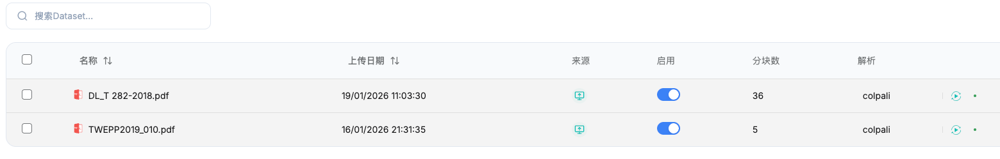
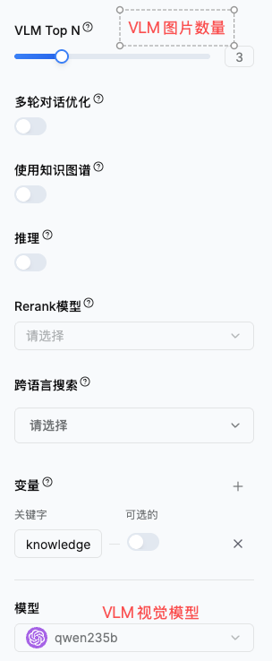

# ColPali 视觉融合检索

ColPali 将 PDF、PPT、图片等页面作为图像理解，适合检索图表、版式、产品图和扫描件。v2.4.6 起，ColPali 改为**文档级视觉检索能力**：同一知识库可以同时包含 ColPali 文档和普通文本解析文档，问答时由视觉路与文本路分别召回，再使用 RRF 融合排序。

## 混合检索如何工作

一次问答会根据所选知识库中的文档类型走两条互不重复的检索路径：

```text
用户问题
├── 文本检索路
│   ├── 只检索普通解析文档
│   ├── 词法检索 + 向量检索
│   └── 可选文本 Rerank
└── ColPali 视觉路
    ├── 只检索 ColPali 解析文档
    ├── FDE 向量粗排
    └── 多向量 MaxSim 精排
             ↓
       RRF 融合两路排名
             ↓
   文本片段 + 最相关页面图像
             ↓
        VLM 生成回答
```

RRF（Reciprocal Rank Fusion，倒数排名融合）依据两路结果的排名合并，而不是直接比较文本相似度和 ColPali MaxSim 分数。这样可以避免两种分数尺度不同导致某一路被错误放大。

:::info 不重复召回
ColPali 文档只进入视觉检索路，普通文档只进入文本检索路。系统不会把 ColPali 页面再次送入文本路，从源头避免同一内容重复召回。
:::

## 适用场景

**推荐使用：**

- 产品目录、设计稿和图片型资料
- 财务报表、数据图表和复杂表格
- PPT 演示文稿
- 扫描件和版式信息重要的 PDF
- 同一业务主题同时包含视觉资料与文字手册的知识库

**不推荐只依赖 ColPali：**

- 答案需要跨多页连续理解的长文档
- 纯文本且对版式不敏感的资料
- 需要对长段落做精细关键词匹配的场景

对于这些资料，可以在同一知识库中继续使用 Smart、Title、Regex 或 Parent-Child 等文本解析方法，让文本路与 ColPali 视觉路互补。

## 前置要求

1. **部署 ColPali API 服务**，默认地址为 `http://colpali-api:9100`。
2. **部署 Milvus**，用于保存和检索 ColPali 多向量。
3. **配置普通文本 Embedding 模型**，供知识库中的非 ColPali 文档使用。
4. **配置 VLM 视觉聊天模型**，用于理解视觉检索返回的页面图像。

使用 Docker Compose 时，ColPali 是可选服务。基础部署默认不会启动它，需要启用 `colpali` profile。

## 使用步骤

### 第一步：准备知识库

创建或打开一个普通知识库，并确认知识库已经配置文本 Embedding 模型。知识库默认解析方法不需要设置为 ColPali。

### 第二步：按文档选择解析方法

上传文档后，为图表、PPT、扫描件等视觉密集型文档选择 **ColPali** 解析；其他文档继续使用适合的文本解析方法。



ColPali 会把文档页面渲染为图像，并为每页生成 FDE 和多向量表示后写入 Milvus。普通文档仍按原有文本分块和向量化流程入库。

:::tip 文档级配置
同一个知识库可以混合使用多种解析方法。是否进入 ColPali 视觉路由由文档的实际解析方式决定，不再由知识库默认解析方法决定。
:::

### 第三步：配置聊天助理

1. 创建或编辑聊天助理。
2. 关联包含 ColPali 文档的知识库。
3. 在高级设置中开启 **ColPali 视觉检索**。
4. 选择支持图片输入的 **VLM 视觉聊天模型**。



开启后，系统才会检查所选知识库中的 ColPali 文档并调用视觉检索。未开启时，普通聊天不会产生额外的 ColPali 检查与服务调用。

:::danger 必须使用 VLM
启用 ColPali 且所选知识库包含 ColPali 文档时，聊天模型必须是 VLM。普通文本模型无法理解召回的页面图像，系统会阻止这种错误配置继续执行。
:::

### 第四步：开始混合问答

用户提问后，系统并行组织文本召回与视觉召回结果。文本路可以继续使用已配置的 Rerank 模型；ColPali 路使用 MaxSim 完成精排；最终通过 RRF 合并排名，并将最相关的页面图像交给 VLM 回答。

## 检索参数

| 参数 | 作用 | 建议 |
| --- | --- | --- |
| Top K | 每条检索路用于召回和融合的候选数量 | 根据知识库规模调整，先使用默认值 |
| VLM Top N | 最终传给 VLM 的页面图像数量 | 建议 3 到 5，控制延迟和上下文成本 |
| 相似度阈值 | 过滤低相关结果 | 从默认值开始，通过真实问题评估 |
| 文本 Rerank | 对普通文本检索结果重新排序 | 按需开启，只作用于文本路 |

ColPali 会优先选取最高相关页面，并尽量保持同一文档页面的连续性。`VLM Top N` 过大既增加模型成本，也可能让无关页面干扰回答。

## 典型知识库组织方式

```text
产品知识库
├── 产品说明书.pdf          Smart 文本解析
├── 安装与维护手册.pdf      Parent-Child 文本解析
├── 产品规格与参数表.pdf    ColPali 视觉解析
├── 培训课件.pptx           ColPali 视觉解析
└── 结构示意图.png           ColPali 视觉解析
```

用户询问“这个型号的安装要求和接口位置是什么”时，文本路可以召回安装手册中的步骤，视觉路可以召回规格页或结构图，RRF 再把两类证据合并给 VLM。

## 常见问题

### 为什么启用后提示必须配置 VLM？

ColPali 召回的是页面图像。请在聊天助理中选择支持图片输入的视觉模型，再重新发起问答。

### 一个知识库可以混用 ColPali 和其他解析方法吗？

可以。v2.4.6 起，ColPali 按文档识别和路由。同一知识库中的视觉文档与普通文档会分别进入视觉路和文本路，结果通过 RRF 合并。

### 文本 Rerank 会影响 ColPali 排名吗？

不会。Rerank 只处理文本路结果；ColPali 使用 MaxSim 排序。两路最终按各自排名做 RRF 融合。

### 为什么没有触发 ColPali 检索？

依次检查：

1. 聊天助理是否开启 ColPali 视觉检索。
2. 所选知识库是否存在已成功按 ColPali 解析的文档。
3. ColPali API 与 Milvus 是否正常运行。
4. 聊天助理是否使用 VLM。

### 跨页问题回答不准确怎么办？

ColPali 以页面为视觉检索单元。对于依赖长上下文或跨章节推理的内容，建议改用文本解析，或在同一知识库中补充文本版本，由混合检索提供连续语义证据。

## 最佳实践

1. 只让视觉信息有价值的文档使用 ColPali，纯文本文档保留文本解析。
2. 用真实业务问题评估两路召回，不要只看单条演示效果。
3. 控制传给 VLM 的图片数量，优先保证相关性而不是堆叠页面。
4. 文档解析方式调整后重新解析，确保向量与当前配置一致。
5. 更新 Milvus 向量结构或 ColPali 模型参数后，按部署要求重建并重新解析相关数据。
