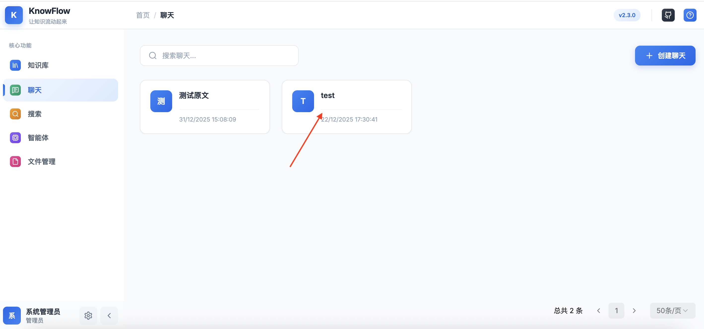
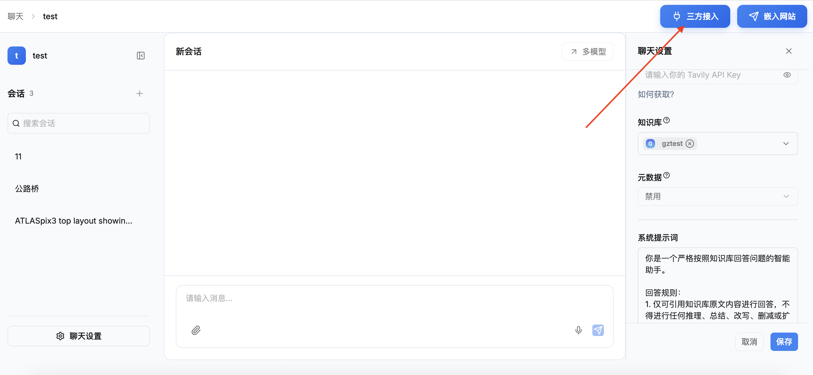
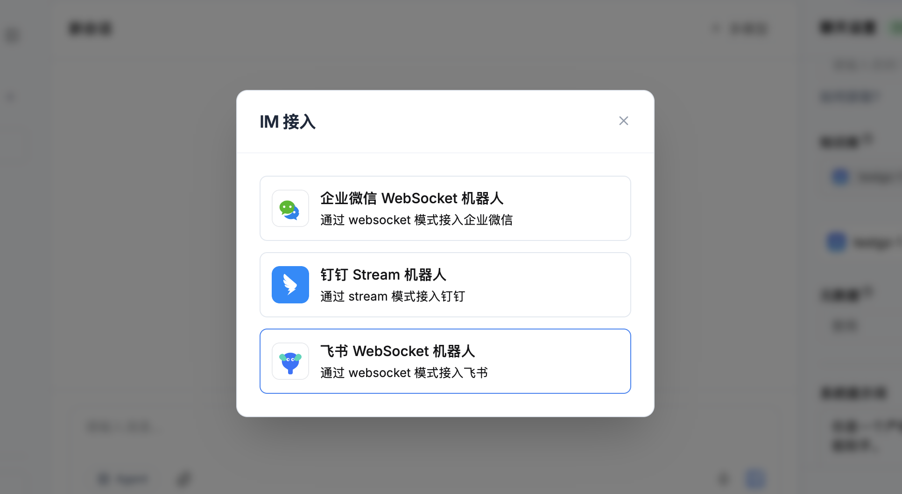
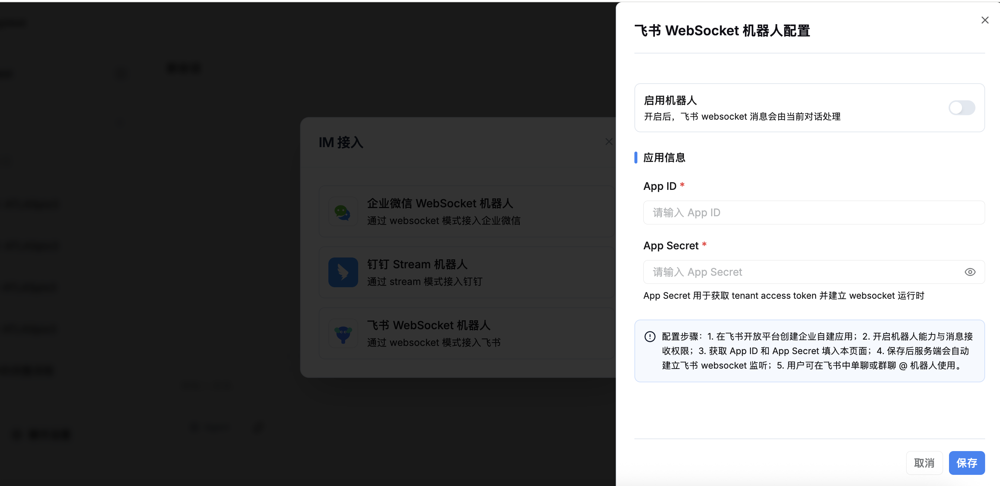
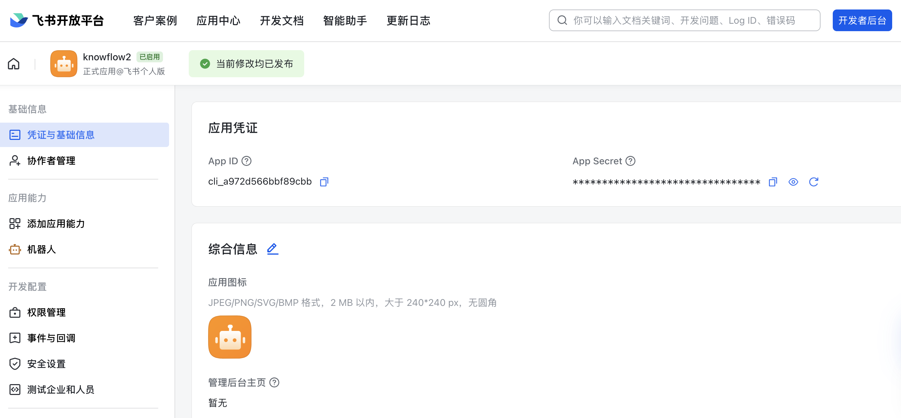
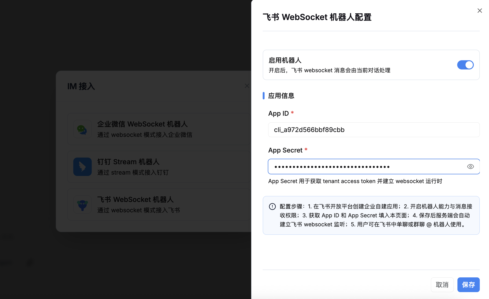
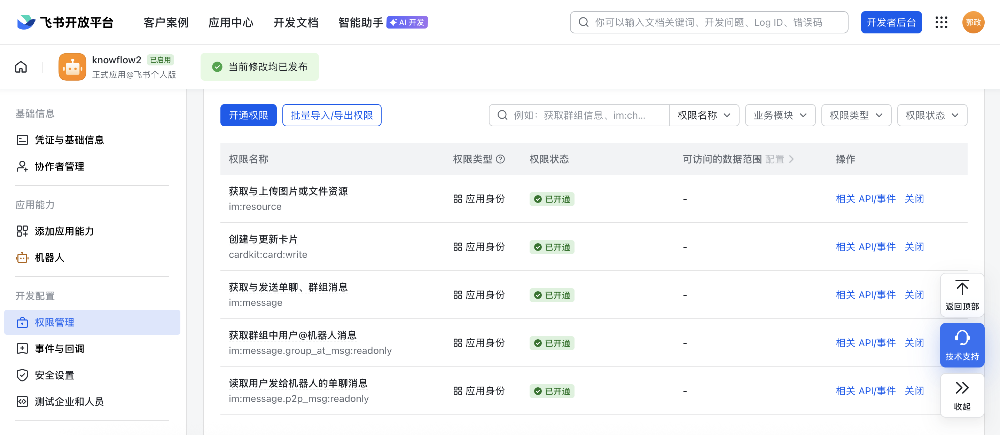
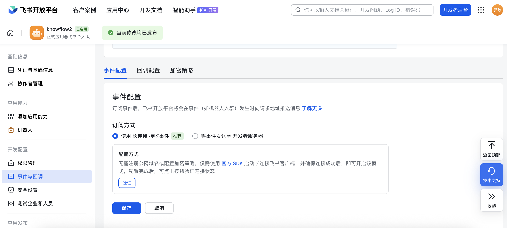
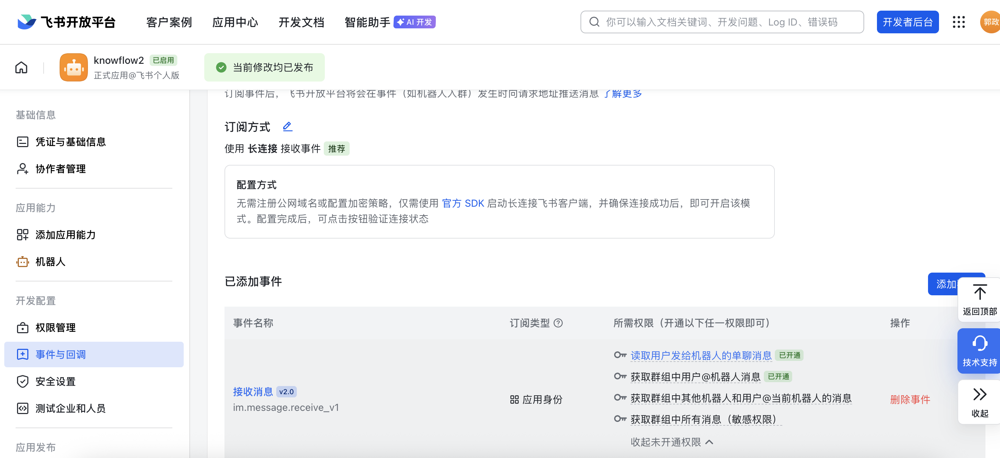
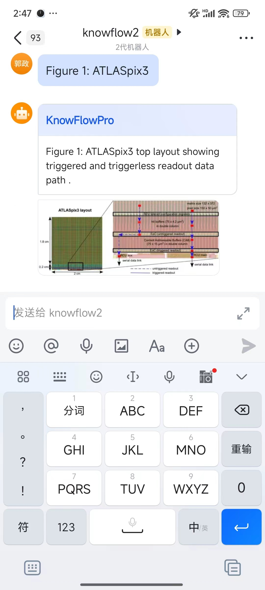

# 飞书接入

## 一、功能简介

将 KnowFlow 配置好的聊天直接接入飞书智能机器人，轻松实现在飞书中使用 KnowFlow。

## 二、配置步骤

### 1. 选择目标聊天

打开 KnowFlow 前端聊天功能，选择一个目标聊天卡片。

### 2. 进入三方接入

点击进入聊天详情页，点击详情页右上角的三方接入按钮。

### 3. 选择飞书应用

在弹出框中选择飞书应用。

### 4. 打开飞书开放平台

点击飞书开放平台的链接：https://open.feishu.cn/app?lang=zh-CN

### 5. 进入飞书应用模块，创建机器人并配置权限

获取 App ID 和 App Secret

### 6. knowFlow 配置并保存

切到 KnowFlow 页面，将获取到的 App ID 和 App Secret 复制粘贴到 KnowFlow 页面的 App ID 和 App Secret 输入框中，打开启用机器人开关，然后底部点击保存。

### 7. 配置飞书机器人权限并发布

1、配置权限，哪些权限需要见下图

2、配置长连接

3、发布机器人

### 8. 验证使用

在手机端，打开飞书应用，在工作台的全部应用中找到机器人。

进行聊天问答，即可在飞书中使用 KnowFlow。

