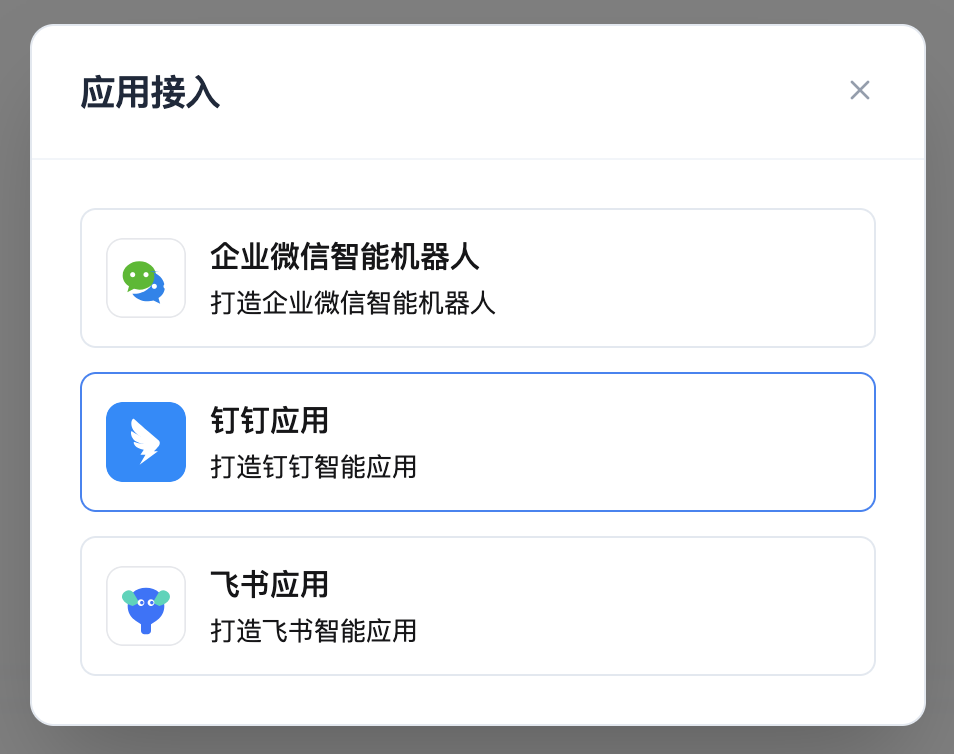
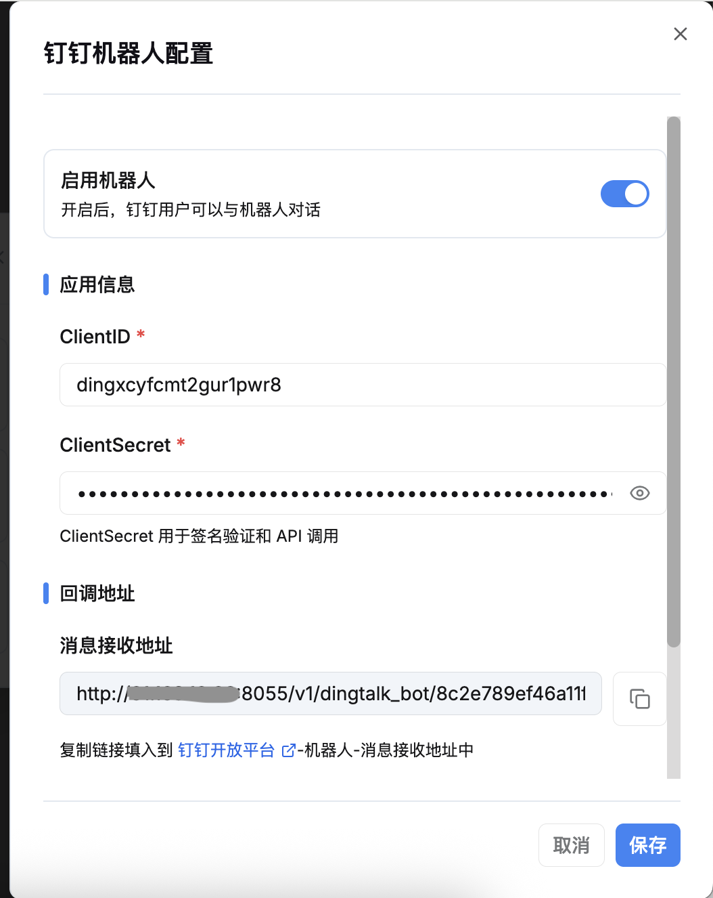
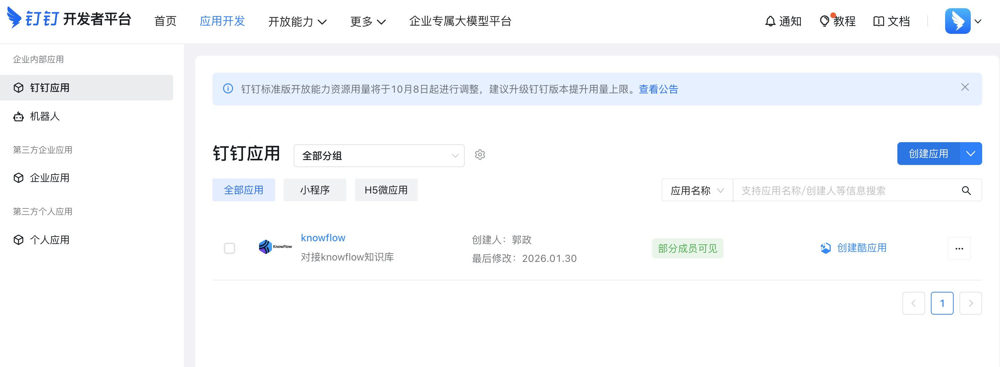
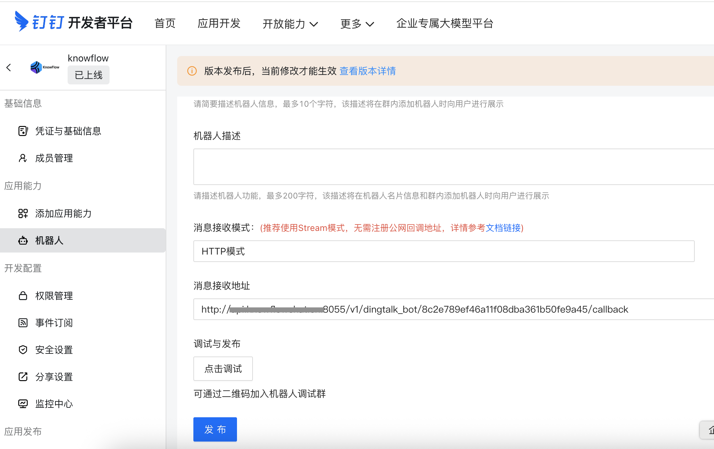
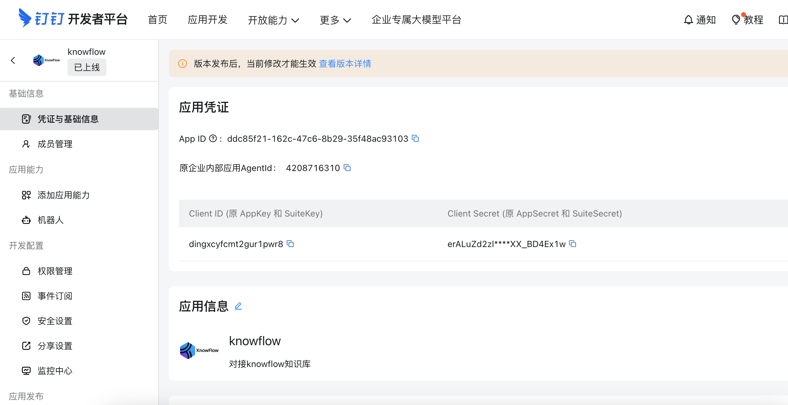
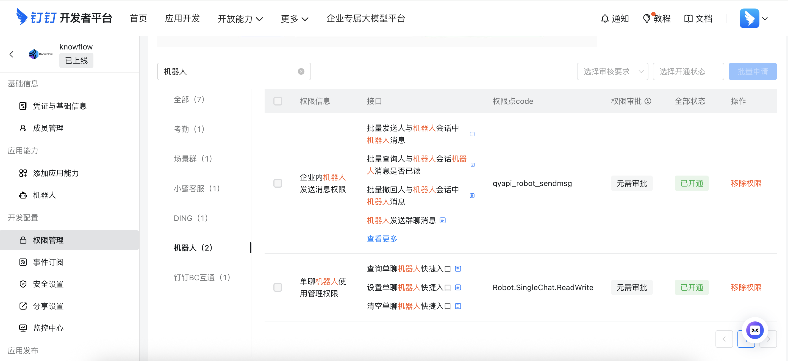
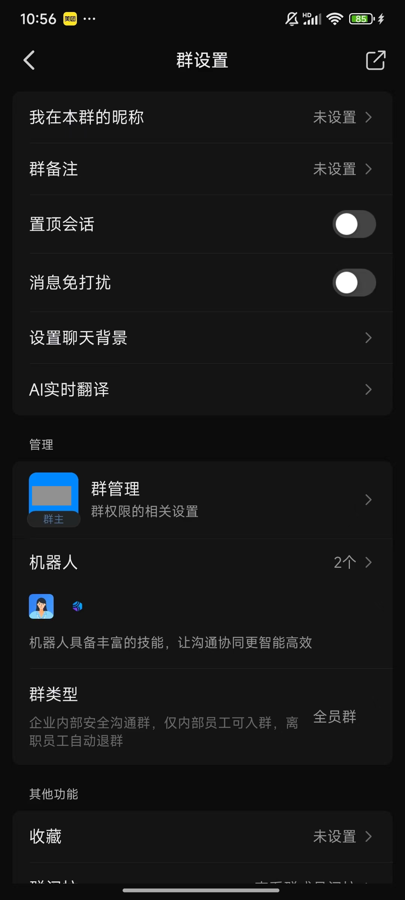
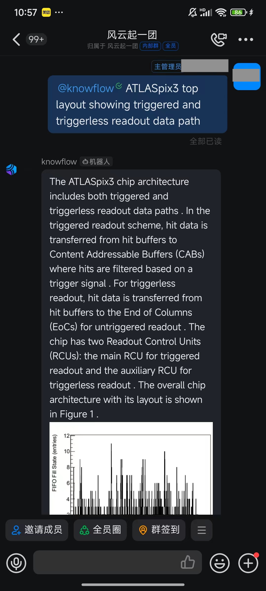
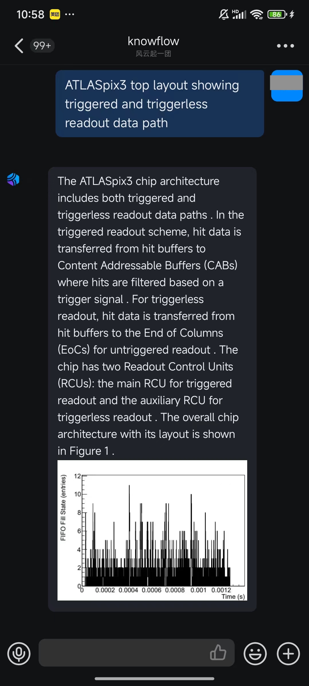

# 钉钉接入

## 一、功能简介

将 KnowFlow 配置好的聊天直接接入钉钉智能机器人，轻松实现在钉钉中使用 KnowFlow。

## 二、配置步骤

### 1. 选择目标聊天

打开 KnowFlow 前端聊天功能，选择一个目标聊天卡片。

### 2. 进入三方接入

点击进入聊天详情页，点击详情页右上角的三方接入按钮。

### 3. 选择钉钉应用

在弹出框中选择钉钉应用。

### 4. 打开钉钉开放平台

点击钉钉开放平台的链接：https://open-dev.dingtalk.com/fe/app?hash=%23%2Fcorp%2Fapp#/corp/app

### 5. 进入钉钉应用模块，创建应用

点击后会在新页面打开钉钉开放平台，在应用开发模块，点击钉钉应用，然后点击右侧内容区域的创建应用。

### 6. 进入应用，点击机器人，进行机器人配置

1、选择 http 模式，输入 KnowFlow 页面中的回调地址。

2、在凭证与基础信息中获取 Client ID  和 Client Secret ，并复制到 KnowFlow 页面中。

### 7. knowFlow 配置并保存

切到 KnowFlow 页面，将获取到的 Client ID 和 Client Secret 复制粘贴到 KnowFlow 页面的 Client ID 和 Client Secret 输入框中，然后先在 KnowFlow 这边点击保存。

### 8.切换到钉钉开放平台，添加机器人的接口权限
切换到钉钉开放平台，进入权限管理，搜索机器人，然后选择机器人模块，开通如图的权限。

### 9. 点击机器人模块，完成钉钉机器人的发布。

### 10. 验证使用

在手机端，打开钉钉应用，在群聊中，点击右上角的 ... 进入群设置，下拉找到机器人并添加，然后即可在群聊中@机器人进行问答。
然后也可以在群聊中点击机器人的头像，进入单聊模式。

