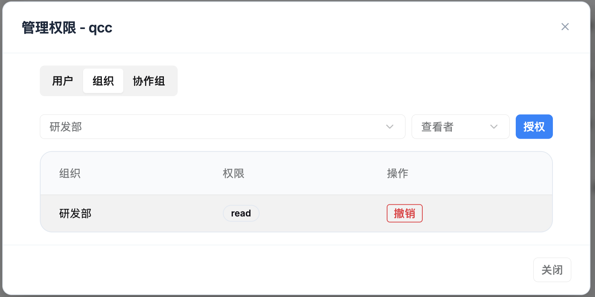
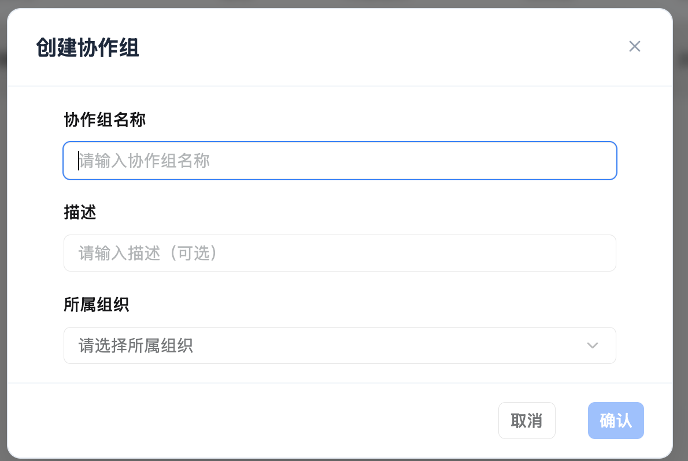
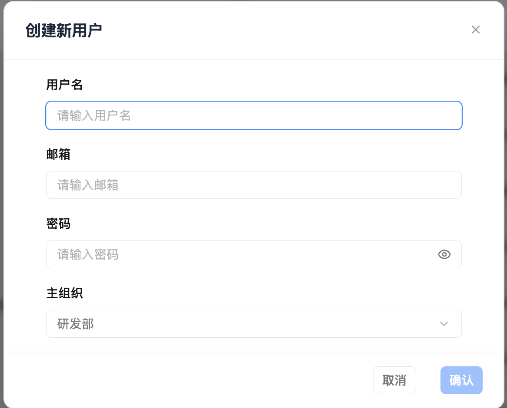

# RBAC 权限管理

KnowFlow 的 RBAC 权限管理用于企业级用户、组织和知识库访问控制。当前版本在原有角色权限基础上，新增了**组织层级**和**组织管理员**能力，并将知识库授权主体收敛为**用户、组织、协作组**三类。

## 核心概念

### 权限管理的三个层面

**1. 平台管理权限**

- 控制谁可以进入管理后台
- 控制用户、组织、协作组、知识库、文件等后台管理能力
- 平台超级管理员拥有全局管理权限

**2. 组织管理权限**

- 组织支持父子层级
- 组织管理员可以管理当前组织及所有下级组织
- 组织管理员可以创建用户，并将用户加入自己管理范围内的组织

**3. 知识库资源权限**

- 控制用户是否可以访问特定知识库
- 授权主体包括用户、组织、协作组
- 权限等级包括查看者、编辑者、管理员
- 文件权限继承知识库权限，不单独配置文件授权

### 权限控制逻辑

KnowFlow 采用分层权限设计：

- 超级管理员负责全局治理，可以管理所有用户、组织、协作组、知识库和文件
- 组织管理员的管理边界是其所在组织及下级组织
- 知识库访问必须通过用户、组织或协作组授权获得
- 对组织授权时，权限会作用于当前组织及所有下级组织成员
- 对协作组授权时，权限只作用于协作组成员

:::tip 组织授权继承规则
如果知识库授权给某个父组织，该父组织及所有下级组织成员都会获得对应知识库权限。
:::

## 角色说明

### 平台超级管理员

平台超级管理员是系统最高权限角色。

可执行操作：

- 查看和管理全部用户
- 创建用户、编辑用户基础信息、重置密码
- 创建任意组织和子组织
- 设置或取消组织管理员
- 创建和管理任意协作组
- 查看和管理全部知识库、文件和授权
- 管理系统配置和用户配置

适用场景：

- 企业知识库平台管理员
- 系统运维负责人
- 需要全局审计和治理权限的管理人员

### 组织管理员

组织管理员是在某个组织节点上被授予的管理身份。其管理范围为**当前组织及所有下级组织**。

可执行操作：

- 查看自己组织子树内的组织、用户、知识库、文件和协作组
- 创建用户，并为用户设置主组织
- 创建下级组织
- 将用户加入组织
- 移除组织成员
- 设置成员主组织
- 设置或取消下级组织范围内的组织管理员
- 管理组织范围内的知识库授权
- 管理归属在自己组织范围内的协作组

限制：

- 不能管理组织范围之外的用户和资源
- 不具备平台级全局管理能力

:::warning 注意
组织管理员不是在用户管理页创建的新角色，而是在**组织架构**页对组织成员设置的身份。
:::

### 普通用户

普通用户主要使用知识库能力，只消费最终权限结果。

普通用户可以访问的知识库来自：

- 直接授予该用户的知识库权限
- 用户所属组织获得的知识库权限
- 用户加入的协作组获得的知识库权限

## 组织架构管理

组织架构用于表达企业的纵向管理关系，例如公司、事业部、部门、小组等。

### 组织规则

- 组织支持多级嵌套
- 每个组织节点只能有一个父组织
- 可以创建根组织，也可以在已有组织下创建子组织
- 不允许形成循环层级
- 组织列表中的成员数为累计成员数，包含当前组织及所有下级组织成员

### 成员管理

在组织成员管理中，可以：

- 添加用户到组织
- 查看直属成员和下级成员
- 移除直属成员
- 查看用户是否为主组织成员
- 设置成员身份为普通成员或组织管理员

用户与组织关系：

- 同一个用户可以加入多个组织
- 同一个用户只能有一个主组织
- 父组织查看成员时，可以看到当前组织及下级组织成员

### 设置组织管理员

设置路径：

1. 进入管理后台
2. 打开**组织架构**
3. 选择目标组织
4. 点击**管理成员**
5. 在成员列表中选择**设为管理员**

设置后，该成员会成为该组织的组织管理员，管理范围覆盖当前组织及所有下级组织。

## 协作组管理

协作组用于横向协作，适合项目组、专项组、临时工作组等跨组织协作场景。

### 协作组规则

- 协作组不属于组织树
- 协作组不支持嵌套
- 协作组成员只能是用户
- 协作组不包含组织节点
- 协作组不设置单独的协作组管理员
- 协作组可以设置所属组织，用于管理范围和筛选

### 协作组操作

管理员可以：

- 创建协作组
- 填写协作组名称和描述
- 选择协作组所属组织
- 添加已有用户为成员
- 移除协作组成员
- 查看协作组成员数

适用场景：

- 跨部门项目组
- 客户交付小组
- 专项知识共建小组
- 临时评审或测试小组

## 用户管理

用户管理用于创建和维护系统用户。平台超级管理员可以管理全部用户；组织管理员可以创建用户，并将用户归属到自己管理范围内的组织。

### 创建用户

创建用户时需要填写：

- 用户名
- 邮箱
- 初始密码
- 主组织

组织管理员创建用户时，主组织应选择其管理范围内的组织。用户创建后，可继续在组织架构中调整组织归属，或加入协作组参与横向协作。

### 用户维护

管理员可以在用户管理中：

- 编辑用户基础信息
- 重置用户密码
- 删除不再使用的用户
- 查看用户主组织和身份

:::tip 管理边界
组织管理员可以创建和维护自己管理范围内的用户，但不应管理组织范围之外的用户和资源。
:::

## 知识库权限管理

知识库权限控制用户对特定知识库的访问和操作能力。

### 授权主体

当前知识库授权支持三类主体：

| 授权主体 | 生效范围 | 适用场景 |
| --- | --- | --- |
| 用户 | 仅对指定用户生效 | 给单个负责人、专家或外部账号单独授权 |
| 组织 | 对当前组织及所有下级组织成员生效 | 按部门、事业部、区域授权 |
| 协作组 | 对协作组成员生效 | 跨部门项目或专项协作 |

:::info 兼容说明
旧版本中的团队授权语义已收敛为组织和协作组。新权限配置建议统一使用用户、组织、协作组三类主体。
:::

### 权限等级

| 权限等级 | 系统值 | 可执行操作 | 适用对象 |
| --- | --- | --- | --- |
| 管理员 | admin | 管理知识库、维护内容、管理授权、删除知识库 | 知识库负责人 |
| 编辑者 | write | 上传文档、编辑内容、触发解析、维护文档 | 内容维护人员 |
| 查看者 | read | 查看知识库、搜索内容、使用问答 | 普通知识使用者 |

### 授权流程

1. 进入管理后台的**知识库管理**
2. 选择目标知识库
3. 打开**管理权限**
4. 选择授权页签：用户、组织或协作组
5. 选择授权对象
6. 选择权限等级：查看者、编辑者或管理员
7. 点击**授权**

如需取消权限，在对应授权列表中点击**撤销**。

### 权限合并规则

同一个用户可能同时通过用户、组织、协作组获得权限。系统会综合计算用户最终权限：

- 直接用户授权只影响该用户本人
- 组织授权会继承到下级组织成员
- 协作组授权只影响组内成员
- 多个授权同时存在时，用户可获得其中最高的有效权限
- 超级管理员拥有全局管理能力

## 典型应用场景

### 场景 1：企业全局管理

配置方式：平台超级管理员

可执行操作：

- 创建用户
- 搭建组织架构
- 创建协作组
- 管理全部知识库和文件
- 设置组织管理员
- 审计和调整所有资源权限

### 场景 2：部门自治管理

配置方式：在部门组织节点中将部门负责人设为组织管理员

可执行操作：

- 管理本部门及下级部门组织结构
- 创建部门用户并设置主组织
- 将用户加入部门
- 管理部门范围内知识库授权
- 创建和维护部门协作组

限制：

- 不能管理其他部门资源

### 场景 3：按部门开放知识库

配置方式：给目标组织授予知识库查看者或编辑者权限

效果：

- 当前组织成员可访问知识库
- 下级组织成员自动获得同等权限
- 新成员加入组织后自动获得组织对应的知识库权限

### 场景 4：跨部门项目协作

配置方式：创建协作组，将项目成员加入协作组，再给协作组授予知识库权限

效果：

- 不需要调整用户组织归属
- 可将来自不同部门的用户放入同一协作组
- 项目结束后撤销协作组权限或移除成员即可

### 场景 5：单用户临时授权

配置方式：给指定用户单独授予知识库查看者、编辑者或管理员权限

适用场景：

- 外部合作账号
- 临时审阅人员
- 需要绕开组织和协作组结构的特殊授权

## 最佳实践

### 1. 先搭组织，再做授权

- 建议先完成组织树和成员归属维护
- 部门类知识库优先授权给组织
- 避免对大量用户逐个授权，降低后续维护成本

### 2. 用协作组处理横向项目

- 跨部门协作不要强行调整组织归属
- 为项目、客户、专项任务创建协作组
- 项目结束后及时清理协作组成员或撤销知识库权限

### 3. 谨慎分配管理员权限

- 平台超级管理员建议控制在少数人员
- 组织管理员只授予真正负责组织治理的人
- 知识库管理员只授予知识库负责人
- 定期检查管理员列表和高权限知识库授权

### 4. 建立权限审查机制

- 定期检查组织成员是否准确
- 定期检查协作组是否仍在使用
- 清理离职、转岗、项目结束后的权限
- 对敏感知识库单独审查管理员和编辑者权限

## 常见问题

### 用户个人被授权查看者，但所在组织被授权编辑者，最终是什么权限？

最终该用户具备**编辑者权限**，可以读取和编辑该知识库。

KnowFlow 会综合计算用户从不同来源获得的权限，包括用户直接授权、组织授权和协作组授权。多个授权同时存在时，不会因为个人授权较低就覆盖组织授权；系统会使用所有有效授权中最高的可用权限。

示例：

| 权限来源 | 授权等级 | 生效结果 |
| --- | --- | --- |
| 用户个人授权 | 查看者 | 用户可读取知识库 |
| 所在组织授权 | 编辑者 | 用户可读取并编辑知识库 |
| 最终权限 | 编辑者 | 取最高有效权限 |

如果希望该用户只能查看，需要撤销或降低其所在组织、协作组上的更高权限。

---

通过组织层级、组织管理员、协作组和知识库授权的组合，KnowFlow 可以同时支持纵向部门治理和横向项目协作，在保持权限模型清晰的同时，降低企业知识库权限维护成本。
