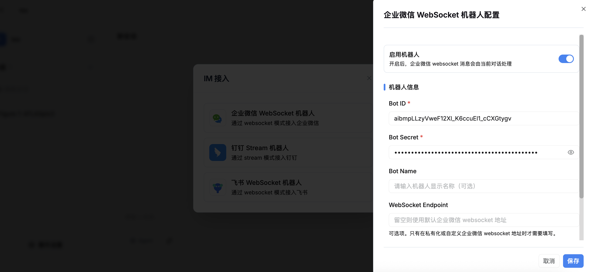
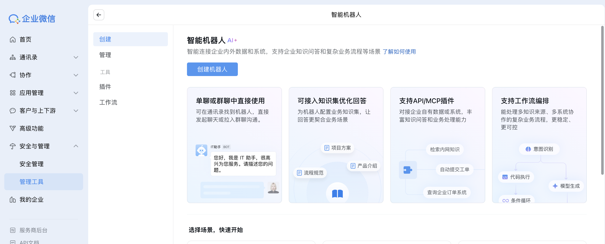
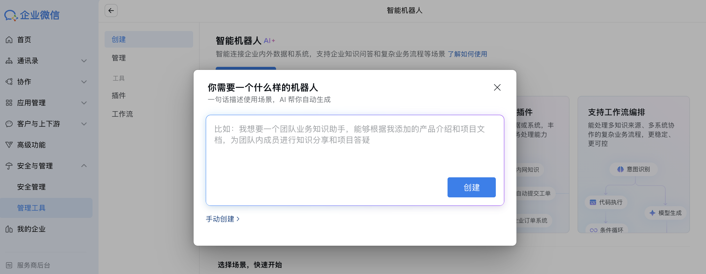
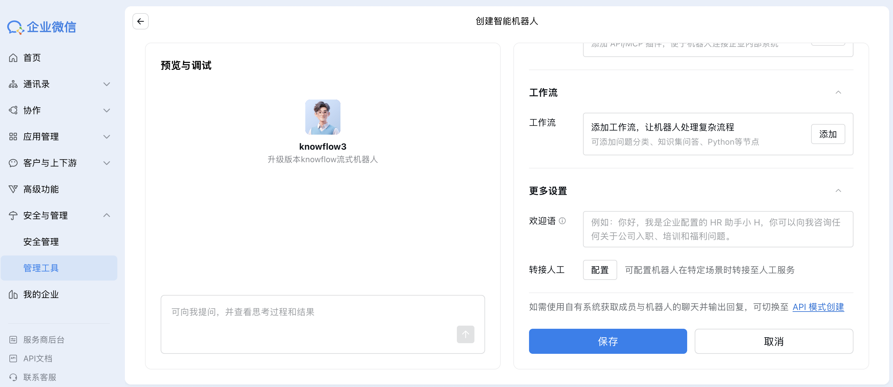
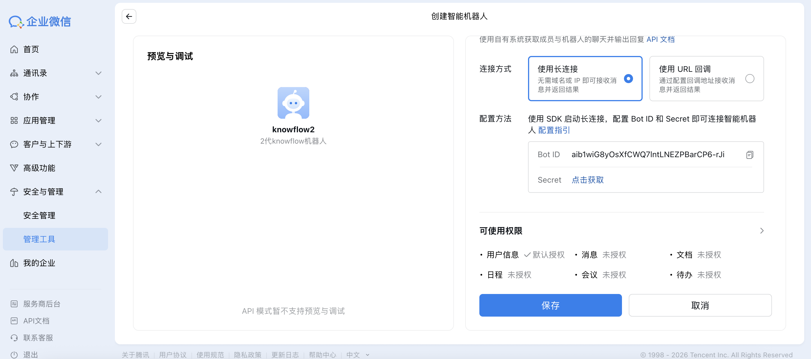
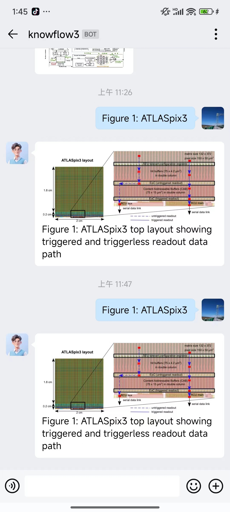

# 企业微信接入

## 一、功能简介

将 KnowFlow 配置好的聊天直接接入企业微信智能机器人，轻松实现在企业微信中接入并使用 KnowFlow。

## 二、配置步骤

### 1. 选择目标聊天

打开 KnowFlow 前端聊天功能，选择一个目标聊天卡片。

### 2. 进入三方接入

点击进入聊天详情页，点击详情页右上角的三方接入按钮。

### 3. 选择企业微信智能机器人

在弹出框中选择企业微信智能机器人。

### 4. 打开企业微信后台

点击企业微信后台的链接：https://work.weixin.qq.com/wework_admin/frame#/manageTools

### 5. 进入智能机器人管理

点击后会在新页面打开企业微信后台，在安全与管理模块，点击管理工具，创建智能机器人，使用长连接方式，获取 Bot ID 和 Secret。

### 6. 配置Bot ID 和 Secret

切到 KnowFlow 页面，将获取到的 Bot ID 和 Secret 复制粘贴到 KnowFlow 页面的 Bot ID 和 Secret 输入框中，打开启用机器人开关，然后点击底部保存。

### 7. 验证使用

使用该智能机器人配置的可见范围人员账号登录自己的企业微信，在通讯录中，点击智能机器人，点击你创建的机器人即可实现单聊，也可以在群聊中，拉入这个机器人，@机器人进行问答。

